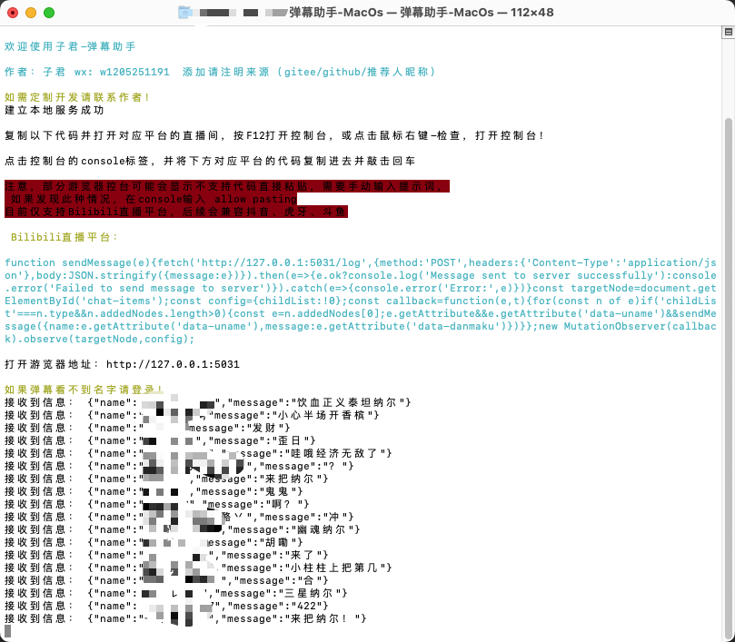
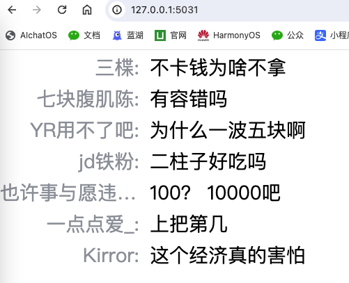
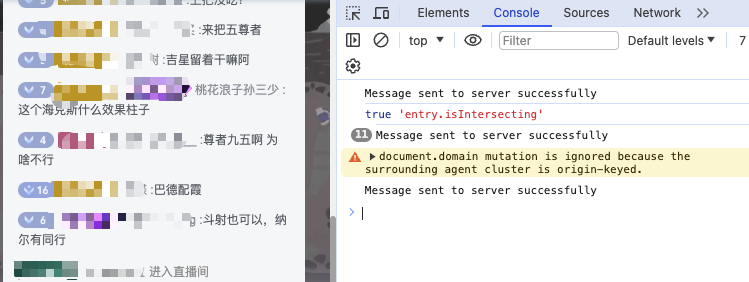

## 使用方法
1. 直接运行 子君弹幕助手.exe
2. 按照窗口提示进行操作。
3. 在直播中使用OBS或直播软件插入网页内容，地址为 http://127.0.0.1:5031/

### 注意
1. 试用版本仅支持使用30分钟，30分钟后服务会自动停止运行，如需长期稳定版本请联系作者。
2. 试用版本未限制直播间地址，这也是为了方便测试，长期稳定版本会限制直播间地址。
3. 如使用试用版本获取他人直播间弹幕，需获得对方同意，否则后果自负，作者不承担任何责任。
4. 如需长期稳定版本并且需要特殊定制请联系作者。

## 为什么使用子君-弹幕助手
1. 无需任何技术基础
2. 无需任何配置
3. 获取弹幕速度快，稳定，延迟在0.1秒以内
4. 可进行多种定制化开发
5. 无需担心数据泄露

## 以下为使用效果

## 可定制内容：
1. 弹幕字体大小、颜色、位置、背景色、透明度等（是的，你可以定制弹幕的任何属性，甚至在显示区域有一个好看的边框也没问题）
2. 获取到弹幕的时间（发言时间）
3. 粉丝牌、粉丝等级、发送的表情（表情可能和平台不一样）
4. 彩虹弹幕（每一条弹幕的颜色都是在一个指定的颜色库中选择的，可以是随机的，也可以是固定的）
5. 房管模式
   1. 房管模式下，可以定制屏蔽词，如过观众的发言中包含设置的屏蔽词，将不会显示在弹幕区域，且发送屏蔽词的观众将会在警告名单中。
   2. 房管模式下，可以查看所有弹幕的发送时间，并支持点击观众名称高亮其所有发言，并复制其名称。
   3. 房管模式下，可以搜索观众发言内容，支持模糊搜索，支持高亮显示搜索结果，支持复制搜索结果。

### 高级定制内容：
1. 根据观众发言间隔绘制高频时间，可帮助主播分析观众活跃时间段。
2. 根据观众发言内容绘制词云，可帮助主播分析观众关注点。
3. MacOS版本

....

更多高级定制内容请联系作者。

#### 以上功能均可定制，列出的并不是所有，可根据主播需求进行进一步定制化开发，请联系作者。

### 承诺：除高级定制外，本软件不收集任何用户信息，不会上传任何数据，不会对用户数据进行任何操作，不会对用户数据进行任何分析，不会对用户数据进行任何传播。
### 作者：子君 微信：w1205251191

